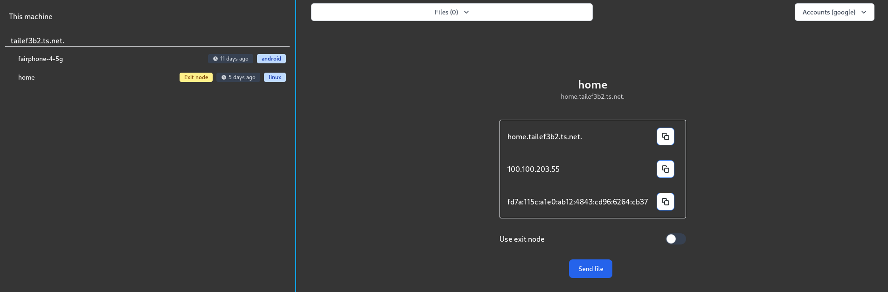

# README

Tailscale client using [Wails](https://wails.io).

# Why a desktop application with JS? WHY!!!???

I am aware that there is some kind of client desktop application for MacOS and maybe Windows,
but there's none for Linux! Therefore, I decided to create one. Now... why Wails?
I am not really a fan of JS (just look at the code, it's horrible, I know...), so I tried Qt,
I like Qt, but I wasn't able to make an HTTP request through a UNIX socket, so I couldn't connect
to the tailscale daemon (tailscaled). Now, I tried Flutter and some GTK stuff, but it's all so difficult
from a beginners' perspective. So I decided to use electron, but electron looked like too much because
I'd have to implement the API from scratch. Now, wails is a nice option, because I don't have to be bothered
to learn more JS than it is required, I can just use Golang for the backend!

# Features

* File upload and reception.
* Account switching (ugly but works).
* Host listing (it is more prepared for headscale than tailscale, so I am open to criticism).
* Select an exit node.
* Host IP listing.
* Some tag description (like OS, or whether it's online or how long since it was last seen).

# Contributions

You can contribute as much as you want, you can even fork the program and remove my name from it, IDGAF.
I just want this program to work and to do what it is supposed to do.

If you know more JS than I do (so more than 8h experience should be enough) you are welcome to open a PR.
No contribution is mundane at all, again you can look by yourself that my JS code is pure garbage :)
